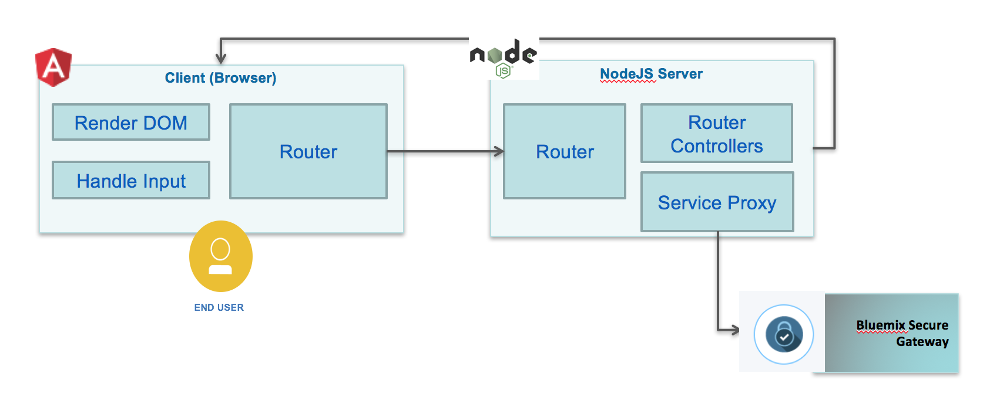

# Case Inc Portal App
In this project we are presenting how to develop an Angular 5 single page application using a Test Driven Development approach and Consumer defined contracts for the Backend For Frontend to support. For production deployment the pages are served with NGinx HTTP server, while the BFF is done in separate project using nodejs / expressjs.

We are covering the following:
* use angular CLI to create module and component for the user interface
* use karma and jasmine to test driven each components
* use Pact to do contract definition and testing, deploying the Pact proxy on IBM Public cloud.

*This project is part of the 'IBM Integration Reference Architecture' suite, available at [https://github.com/ibm-cloud-architecture/refarch-integration](https://github.com/ibm-cloud-architecture/refarch-integration) and implements the 'cloud native' web application developed. It should be considered as an internal portal application for CASE Inc internal staff.*

## Table of Contents
* [Introduction](#introduction)
* [Pre Requisites](#pre-requisites)
* [Build](#build)
* [Run](#run)
   * [Locally](#run-the-application-locally)
   * [IBM Cloud as cloud foundry](#run-on-ibm-cloud-as-cloud-foundry)
   * [IBM Cloud container service](#deploy-the-caseinc-portal-app-in-ibm-cloud-kubernetes-service)
   * [IBM Cloud Private](./docs/icp/README.md)
* [Code explanation](#code-explanation)
* [Security](./docs/login.md)
* [devops](./docs/devops/README.md)
* [Compendium](#compendium)

## Introduction
This application illustrates how to plug and play different Angular 4 module with different back ends of IBM Cloud reference architecture, and specifically addresses:
* the inventory management feature to demonstrate hybrid integration as presented in the [hybrid integration reference architecture center web site](https://www.ibm.com/devops/method/content/architecture/hybridArchitecture).   
* how to support login with a LDAP server running on-premise and exposed via IBM API connect
* how to develop with Angular 4 a simple user interface, with the master-detail pattern for Item and Inventory.
* how to integrate with back end, on-premise services using secure gateway
* how to proxy  [Watson Conversation](https://www.ibm.com/devops/method/content/architecture/cognitiveConversationDomain2#1_1)
* how to deploy the app as Cloud Foundry on IBM Cloud, docker container on IBM Cloud Container or Helm charts on IBM Cloud Private
* how to use Jenkins for continuous integration and deployment

The current top level view of the home page of this application looks like:   

  

For public cloud deployment the application is up and running at the following address: http://caseincapp.mybluemix.net/. When deployed on IBM Cloud Private the URL is http://portal.brown.case. You will need some DNS or hosts mapping to support this direct access.

## Pre-requisites
The common pre-requisites for the integration solution are defined [here](https://github.com/ibm-cloud-architecture/refarch-integration#prerequisites), so be sure to get them done.
* Clone the current repository, or if you want to work on the code, fork it in your own github repository and then clone your forked repository on your local computer. If you used the `fork-repos.sh` script from the [Integration solution](https://github.com/ibm-cloud-architecture/refarch-integration) main repository, you are already set.

```
git clone https://github.com/ibm-cloud-architecture/refarch-caseportal-app
cd refarch-caseportal-app
npm install
```
* You need to install Angular 5 command line interface if you do not have it yet: see the [cli.angular.io website](http://cli.angular.io)
 ```
 sudo  npm install -g @angular/cli
 ```
 on Mac, as a global install you need to be `root` user or a "sudoer" user.
* As we are using docker to build different images, you need docker engine on your laptop.
* [Optional] To do consumer driven contract and contract testing you need to install Pact.
```
FIXME
```

# Build
To build the angular app locally run the command:
```
$ ng build
```

When involving a continuous integration using Jenkins the jenkins file executes the script in the good order:
```

```
When compiling the angular typescripts the javascript code generated is saved under `dist` folder. It is copied to the NGinx html folder when the docker image is built.

# Run
We are proposing multiple deployment and execution environments:
* run locally using **NGinx** docker image
* run the application in IBM Cloud Container service
* run the application in IBM Cloud Private
### API Connect Specifics
The *xibmclientid* is coming from the application you defined in APIC Connect portal. So connect to the API Connect developer portal, a URL built from the organization settings, like http://172.16.254.90/csplab/sb, create a user account and define an Application. The Client ID string is accessed via the show check box:

Copy this string in
```
"apiGateway" :{
  "hostUrl": "https://172.16.50.8",
  "url": "/csplab/sb/iib-inventory-api",
  "xibmclientid": "59a3 xxx  e9eedb"
```
The url is coming from the organization settings and the product name (iib-inventory-api).

## Run the application locally

To start the application using node monitoring use the command:
```
npm run dev
```
To run in non-development mode
```
npm start
```

The trace should display a message like below with the url to use
```
[1] starting `node server/server server/server`
[1] Server v0.0.2 starting on http://localhost:6004
```

Point your web browser to the url: [http://localhost:6004](http://localhost:6004) to get access to the user interface of the home page.

The demonstration script is described in this [note](docs/demoflow.md)

## Run on IBM Cloud as cloud foundry
To avoid conflict with existing deployed application you need to modify the Manifest.yml file with a new host name.
```yaml
  host: yourcaseincapp
```

Use the set of IBM Cloud CLI commands to upload the application:
```
cf login api.ng.bluemix.net
cf push
```

This should create a new cloud foundry application in your IBM Cloud space as illustrated by the following screen copy.  


## Deploy on Kubernetes and minikube VM
See the note [here](docs/run-minikube.md)

## Deploy the CaseInc Portal App in IBM Cloud Kubernetes Service
A dockerfile is defined in the root project folder to build a docker image from the node:alpine official image. The docker file is simple and use the port 6100.

```
MAINTAINER https://github.com/ibm-cloud-architecture - IBM
WORKDIR /caseportal
COPY . /caseportal
RUN cd /caseportal
RUN npm install
EXPOSE 6001
CMD node server/server.js
```

* You first need to be sure the Angular UI Typescript files are compiled. We have developed a simple gradle file for that. Execute the following command to compile the UI
```
./gradlew build
```

** To build the docker image use the following command: The . represents the current project folder where.

```
$ docker build -t case/webportal .
# the image case/webportal should be visible in you local repository
$ docker images
```

Optionally you may want to run it locally: instead of using the `npm run dev` command used during pure development phase, use the command:
```
docker run -d -p 6100:6100 -t case/webportal
````

* push the image to IBM Cloud registry:
Once built, the image is uploaded to the IBM Cloud private container registry `registry.ng.bluemix.net/<namespace>/<imagename>`.

To get the list of namespace defined into your account use:
```
$ bx cr login
$ bx cr info                                    
```

For example the namespace we are using is `ibm_nls` so we need to tag the image and upload it, using:
```
docker tag case/webportal  registry.ng.bluemix.net/ibm_mls/casewebportal

docker push registry.ng.bluemix.net/ibm_mls/casewebportal
```

Once the image is uploaded it is possible to build a Kubernetes Deployment
```
$ bx login -a https://api.ng.bluemix.net
# initialize your access to the cluster
$  bx cs init
# Get the list of cluster: you should have one per region.
$ bx cs clusters
>OK
Name            ID                     State    Created                    Workers   Datacenter   
brown-cluster   664c66d603e            normal   2017-07-18T14:59:40+0000   1         hou02
```
Set the cluster as the context for your interaction session
```
$  bx cs cluster-config brown-cluster

> export KUBECONFIG=/Users/jeromeboyer/.bluemix/plugins/container-service/clusters/brown-cluster/kube-config-hou02-brown-cluster.yml
```

To be able to use the kubernetes command line interface `kubectl` you need to execute the export
```
$ export KUBECONFIG=/Users/jeromeboyer/.bluemix/plugins/container-service/clusters/brown-cluster/kube-config-hou02-brown-cluster.yml
```


 and deploy the container to the pods. The commands are:

```
# Create a Deployment and run it on the pods
$ kubectl run caseportal --image=registry.ng.bluemix.net/ibm_mls/caseportal --port=6100
```

## Run on IBM Cloud Private

see [this note](docs/run-icp.md)

# Code explanation
Most of the interactions the user is doing on the Browser are supported by [Angular 2](http://angular.io) javascript library, with its Router mechanism and the DOM rendering capabilities via directives and components. When there is a need to access data to the on-premise server for persistence, an AJAX call is done to server, and  the server will respond asynchronously later on. The components involved are presented in the figure below in a generic way


To clearly separate codebases for front- and back-ends the client folder defines angular 2 code while server folder includes the REST api for front end implemented with expressjs

## Angular app
The application code is under the client folder, and follows the standard best practice for Angular 2 development:
* unique index.html to support single page application
* use of modules to organize features
* use of component, html and css per feature page
* encapsulate calls to back end for front end server via service components

For the inventory the component in client/app/inventory folder use a service to call the nodejs / expressjs REST services as illustrated in the code below:  

```javascript
export class InventoryService {
  private invUrl ='/api/i';

  constructor(private http: Http) {
  };

  getItems(): Observable<any>{
    return this.http.get(this.invUrl+'/items')
         .map((res:Response) => res.json())
  }
}
```
The http component is injected at service creation, and the promise returned object is map so the response can be processed as json document.

An example of code using those service is the inventory.component.ts, which loads the inventory during component initialization phase.

```javascript
export class InventoryComponent implements OnInit {

  constructor(private router: Router, private invService : InventoryService){
  }

  // Uses in init to load data and not the constructor.
  ngOnInit(): void {
    this.getItems();
  }
}
```

For detailed on the Angular 2 code see [this note](docs/userinterface.md)
## Server code
The application is using nodejs and expressjs standard code structure. The code is under *server* folder. The inventory API is defined in the server/routes/feature folder and uses request library to perform the call to the Secure Gateway public API combined with the Inventory API secure gateway. The env.json

```javascript
const config = require('../env.json');
const apiUrl=config.secureGateway.url+config.apiGateway.url+"/items";

router.get('/items', function(req,res){
  console.log("In inventory get all the items from the exposed api");
  var h = {
    'X-IBM-Client-Id': config.apiGateway.xibmclientid,
    'Accept': 'application/json',
    'Authorization': 'Bearer '+req.headers.token
  }
  request.get(
      {url:apiUrl,
      timeout: 5000,
      headers: h
      },
      function (error, response, body) {

      }
     );

});

```

## Adding other features
The portal application includes a simple chat bot integration to ask IT support related questions by using Watson Conversation. The approach is detailed in [cognitive compute conversation code](https://github.com/ibm-cloud-architecture/refarch-cognitive-conversation-broker). In the context of this application to enable this capability you need to do the following:
* Have you own copy of the Conversation Broker project
* Add a new Watson conversation service in your IBM Cloud space and develop the Conversation artifacts.
* Reference your IBM Cloud Watson Conversation service into the conversation broker
* Deploy the broker to IBM Cloud
* Modify the env.json to reference the broker URL
* Enable the user interface to present the feature access by setting the mode to cyan in env.json
```
    "mode" : "cyan"
```
For the conversation demo script please refers to this [node](https://github.com/ibm-cloud-architecture/refarch-cognitive-conversation-broker/blob/master/doc/demoflow.md)

## Compendium
* [Angular 2.4 tutorial from the angular site](https://angular.io/tutorial) this tutorial is updated with new release and covers the most important features used in our angular app.
* [NG Develop](https://www.ngdevelop.tech/) to learn the latest news on Angular and its tutorial
