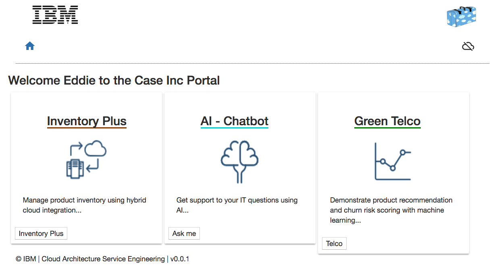
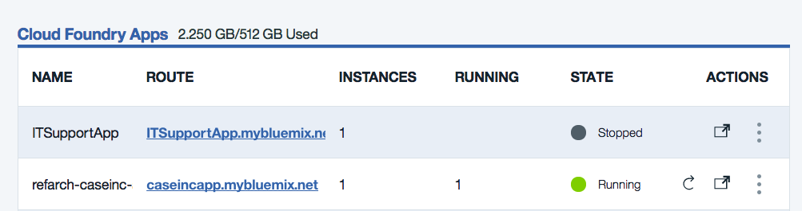

# Case Inc Portal App
In this project we are presenting how to develop a Angular 6 single page application using a Test Driven Development approach and a Back end For Front component done with nodejs / expressjs.  The BFF is used to serve the HTML and javascript for the browser and the user access the server URL. The BFF code is under server folder.

*This project is part of the 'IBM Integration Reference Architecture' suite, available at [https://github.com/ibm-cloud-architecture/refarch-integration](https://github.com/ibm-cloud-architecture/refarch-integration) and implements the 'cloud native' web application with a set of features to demonstrate all the use case for hybrid cloud, cognitive and analytics. It should be considered as an internal portal application for CASE Inc internal staff to access a set of internal features.*

Update 09/14/2018 - Integrate Analytics demonstrations for [https://github.com/ibm-cloud-architecture/refarch-analytics](https://github.com/ibm-cloud-architecture/refarch-analytics) reference architecture.

## Target audiences

The main target of this project and all the related content is developer, who wants to get a concrete implementation that is more than a simple hello world or a light proof of concepts as it covers:
  * Classical Angular 5 single page application served by a nodejs app. We tried to add some tricks we are discovering on Angular.
  * Implement the back end for front end logic inside the nodejs, expressjs middleware framework.
  * How to use a [Test Driven Development](./docs/tdd.md) approach for Angular app development.
  * How to access API defined in API Connect and deploy on API gateway on premise or on ICP  
  * How to integrate with secure gateway when deployed on public cloud to access on-premise servers
  * How to package as a docker image
  * How to define helm chart for IBM Cloud Private and kubernetes cluster deployment.

## Table of Contents
* [Introduction](#introduction)
* [Pre Requisites](#pre-requisites)
* [Build](#build)
* [Run](#run)
   * [Locally](#run-the-application-locally)
   * [IBM Cloud as cloud foundry](#run-on-ibm-cloud-as-cloud-foundry)
   * [IBM Cloud container service](#deploy-the-caseinc-portal-app-in-ibm-cloud-kubernetes-service)
   * [IBM Cloud Private](./docs/icp/README.md)
* [Code explanation](./docs/code-explanation.md)
* [Security](./docs/login/README.md)
* [devops](./docs/devops/README.md)
* [Compendium](#compendium)

## Introduction
This application illustrates how to plug and play different Angular modules with different back end APIs used to demonstrate IBM Cloud hybrid integration and analytics reference architectures, in particular:
* the inventory management feature to demonstrate hybrid integration as presented in the [hybrid integration reference architecture center web site](https://www.ibm.com/devops/method/content/architecture/hybridArchitecture). This is a simple front end to manage old computers inventory, which is persisted in DB2, exposed via a SOAP data access layer service, and with ESB mediation flow and API management. The Angular code is under `src/app/features/inventory` folder, and for the server part it is in `server/routes/feature/inventoryClient.js`. There are, in fact, two client implementations done: One client is accessing directly the SOAP web service and do XML to JSON mapping using Javascript, and the other one to access the API exposed with API Gateway to get JSON payload via REST APIs.
* how to support login with a LDAP server running on-premise and exposed via IBM API connect: Angular feature in `src/app/features/login` and corresponding server code in passport.js, see [this article for details.](docs/login/README.md)
* how to develop with Angular a simple user interface, with the master-detail pattern for Item and Inventory, and how to use Angular 6 Material.
* how to integrate with back end, on-premise services using secure gateway when the app is deployed on IBM Cloud public.
* how to proxy  [Watson Conversation](https://www.ibm.com/devops/method/content/architecture/cognitiveConversationDomain2#1_1)
* how to deploy the app as Cloud Foundry on IBM Cloud, or docker container on IBM Cloud Container or Helm charts on IBM Cloud Private
* how to use Jenkins for continuous integration and deployment
* how to package as a docker image deployable to Kubernetes cluster.

The current top level view of the home page of this application looks like:   

  

For public cloud deployment the application is up and running at the following address: http://caseincapp.mybluemix.net/. When deployed on IBM Cloud Private the URL is http://portal.brown.case. You will need some DNS or hosts mapping in your `/etc/hosts` to support this direct access.

## Pre-requisites
The common pre-requisites for the integration solution are defined [here](https://github.com/ibm-cloud-architecture/refarch-integration#prerequisites), so be sure to get them done.
* Clone the current repository, or if you want to work on the code, fork it in your own github repository and then clone your forked repository on your local computer. If you used the `fork-repos.sh` script from the [Integration solution](https://github.com/ibm-cloud-architecture/refarch-integration) main repository, you are already set.

```
git clone https://github.com/ibm-cloud-architecture/refarch-caseportal-app
cd refarch-caseportal-app
npm install
```
The package.json defines dependencies for the nodejs server component and the Angular application.

* You need to install Angular 5 command line interface if you do not have it yet: see the [cli.angular.io website](http://cli.angular.io)
 ```
 sudo  npm install -g @angular/cli
 ```
 on Mac, as a global install you need to be `root` user or a "sudoer" user.
* As we are using docker to build different images, you need docker engine on your laptop.


## Build
To build the angular app locally run the command:
```
$ ng build
```

When involving a continuous integration using Jenkins the jenkins file executes the scripts defined in the scripts folder. The stages are build, and deploy to ICP. See the [jenkinsfile]().

When compiling the angular typescripts the javascript code generated is saved under `dist` folder.

## Run
We are proposing multiple deployments and execution environments:
* run locally using `npm run dev` or `node server/server`, then load the http://localhost:6100 URL in your web browser.
* run the application in IBM Cloud Container service
* run the application in IBM Cloud Private

### Run the application locally

To start the application using node monitoring use the command:
```
npm run dev
```
The trace should display a message like below with the url to use
```
[1] starting `node server/server server/server`
[1] Server v0.0.2 starting on http://localhost:6100
```

Point your web browser to the url: [http://localhost:6100](http://localhost:6100) to get access to the user interface of the home page.

The demonstration script is described in this [note](docs/demoflow.md)

### Run on IBM Cloud as cloud foundry app
To avoid conflict with existing deployed application you need to modify the Manifest.yml file with a new host name.
```yaml
  host: yourcaseincapp
```
and define your own conversation support.

Use the set of IBM Cloud CLI commands to upload the application:
```
cf login api.ng.bluemix.net
cf push
```

This should create a new cloud foundry application in your IBM Cloud space as illustrated by the following screen copy.  


## Deploy on Kubernetes and minikube VM
See the note [here](docs/run-minikube.md)

## Deploy the CaseInc Portal App in IBM Cloud Kubernetes Service
A dockerfile is defined in the root project folder to build a docker image from the node:alpine official image. The docker file is simple and use the port 6100.

```
MAINTAINER https://github.com/ibm-cloud-architecture - IBM
WORKDIR /caseportal
COPY . /caseportal
RUN cd /caseportal
RUN npm install
EXPOSE 6001
CMD node server/server.js
```

* You first need to be sure the Angular UI Typescript files are compiled. We have developed a simple gradle file for that. Execute the following command to compile the UI
```
./gradlew build
```

** To build the docker image use the following command: The . represents the current project folder where.

```
$ docker build -t case/webportal .
# the image case/webportal should be visible in you local repository
$ docker images
```

Optionally you may want to run it locally: instead of using the `npm run dev` command used during pure development phase, use the command:
```
docker run -d -p 6100:6100 -t case/webportal
````

* push the image to IBM Cloud registry:
Once built, the image is uploaded to the IBM Cloud private container registry `registry.ng.bluemix.net/<namespace>/<imagename>`.

To get the list of namespace defined into your account use:
```
$ bx cr login
$ bx cr info                                    
```

For example the namespace we are using is `ibm_nls` so we need to tag the image and upload it, using:
```
docker tag case/webportal  registry.ng.bluemix.net/ibm_mls/casewebportal

docker push registry.ng.bluemix.net/ibm_mls/casewebportal
```

Once the image is uploaded it is possible to build a Kubernetes Deployment
```
$ bx login -a https://api.ng.bluemix.net
# initialize your access to the cluster
$  bx cs init
# Get the list of cluster: you should have one per region.
$ bx cs clusters
>OK
Name            ID                     State    Created                    Workers   Datacenter   
brown-cluster   664c66d603e            normal   2017-07-18T14:59:40+0000   1         hou02
```
Set the cluster as the context for your interaction session
```
$  bx cs cluster-config brown-cluster

> export KUBECONFIG=/Users/jeromeboyer/.bluemix/plugins/container-service/clusters/brown-cluster/kube-config-hou02-brown-cluster.yml
```

To be able to use the kubernetes command line interface `kubectl` you need to execute the export
```
$ export KUBECONFIG=/Users/jeromeboyer/.bluemix/plugins/container-service/clusters/brown-cluster/kube-config-hou02-brown-cluster.yml
```


 and deploy the container to the pods. The commands are:

```
# Create a Deployment and run it on the pods
$ kubectl run caseportal --image=registry.ng.bluemix.net/ibm_mls/caseportal --port=6100
```

## Run on IBM Cloud Private

see [this note](docs/run-icp.md)

## Compendium
* [Angular 2.4 tutorial from the angular site](https://angular.io/tutorial) this tutorial is updated with new release and covers the most important features used in our angular app.
* [NG Develop](https://www.ngdevelop.tech/) to learn the latest news on Angular and its tutorial
