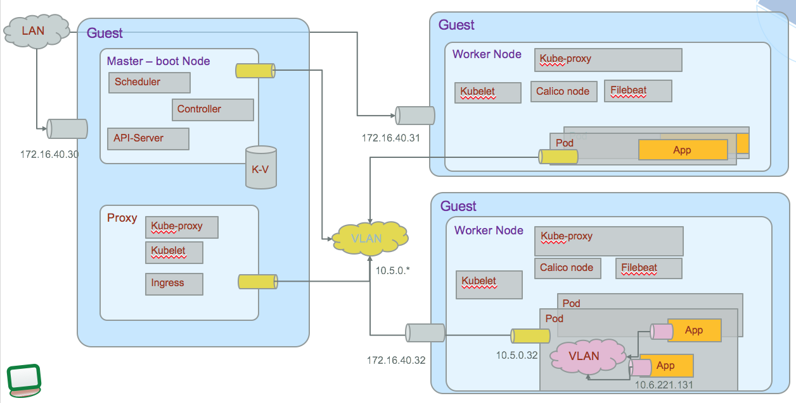
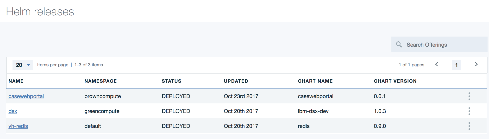

# Run 'Case Web Portal' on IBM Cloud Private

Not all cloud native applications need to run on public cloud. In this note we address the deployment to IBM Cloud Private and how to transform the app started from a cloud foundry template to be less dependent to CF and containerizable.

We propose to package this nodejs webapp as a docker image, build a helm chart and then publish it to an IBM Cloud Private instance. To support higher availability we propose to have 3 replicas for the application, and expose it so it can be visible outside of the ICP cluster. The target deployment may look like the following diagram where the webapp is running in pod as container and is deployed in 3 instances to support high availability:


Updated 11/15/2107. [Back to home page](../../README.md)

## Table of contents
The table of content represents the development steps to follow:
* [Prerequisites](#prerequisites)
* [Build and packaging](#build-and-dockerize)
* [Configure the helm package](#configure-helm-chart)
* [Deploy to ICP](#deploy-the-helm-package)
* [Validate deployment](#validate-the-deployment)
* [What next](#what-next)
* [Troubleshoot](#troubleshoot)

## Prerequisites
See this [list](https://github.com/ibm-cloud-architecture/refarch-integration/blob/master/docs/icp/README.md#prerequisites) for common ICP prerequisites.

We assume the cluster name is: **greencluster.icp** and a namespace was created with the name **browncompute**.

## Build and Dockerize
As seen in the section [Deploy the CaseInc Portal App in IBM Cloud Kubernetes Service](https://github.com/ibm-cloud-architecture/refarch-caseinc-app#deploy-the-caseinc-portal-app-in-bluemix-kubernetes-service), this project includes a docker file to build a docker image. You can build the image to your local repository using the commands:
```
# first build the App
$ npm run build
$ docker build -t ibmcase/portal .
$ docker images
```
Then tag your local image with the name of the remote ICP master server where the docker registry resides. (`mycluster.icp:8500` is the remote server)
```
$ docker tag ibmcase/portal greencluster.icp:8500/browncompute/caseportal:v0.0.3
$ docker images
```
An image with the scope namespace is only accessible from within the namespace that it was pushed to.

### Push docker image to ICP private docker repository

If you have copied the ICP master host certificate / public key to the `/etc/docker/certs.d/hostname:portnumber` folder on your local computer, you should be able to login to remote docker engine. (If not see this section: [Access ICP docker](https://github.com/ibm-cloud-architecture/refarch-integration/blob/master/docs/icp-deploy.md#access-to-icp-private-repository))
Be sure that there is a name resolution available via your dns or your local `/etc/hosts`. To login use a userid known by ICP, could be admin user.
```
docker login greencluster.icp:8500
User: admin
Password:
```
Push the image
```
docker push greencluster.icp:8500/brown/caseportal:v0.0.3
```
For more information about working with the docker registry that is on the ICP master node read  [this note](https://www.ibm.com/developerworks/community/blogs/fe25b4ef-ea6a-4d86-a629-6f87ccf4649e/entry/Working_with_the_local_docker_registry_from_Spectrum_Conductor_for_Containers?lang=en)

## Configure Helm Chart
Helm is a package manager to deploy application and service to Kubernetes cluster. Package definitions are charts, which are yaml files, to be shareable between teams.

The first time you need to build a chart for any web app, select a chart name (e.g. casewebportal) and then use the command like below. YOU DO NOT NEED to do that now as we already built this chart for this project.
```
$ helm init casewebportal
```

This creates yaml files and simple set of folders. Those files play a role to define the configuration and package for kubernetes. Under the templates folder the yaml files use parameters coming from helm, the values.yaml and chart.yaml.

### Chart.yaml
This is a global parameter file. Set the version and name attributes, as they will be used in deployment.yaml. Each time you deploy a new version of your app you can just change the version number. The values in the chart.yaml are used in the templates.

### Add configMap template
The webapp is using external configuration file: `config.json` to get parameters for external end point configuration or for internal flags. For example the Watson conversation broker end points are defined in this file. While using cloud foundry or pure local nodejs deployment this file is read from the filesystem by the server.js. But with kubernetes pods the best practice is to export this configuration into `ConfigMap`.
To do so we need to create a new template: `templates/configmap.yaml`. This file uses the same structure as the `config.json` file:

```yaml
apiVersion: v1
kind: ConfigMap
metadata:
  name: {{ template "fullname" . }}
  labels:
    chart: "{{ .Chart.Name }}-{{ .Chart.Version | replace "+" "_" }}"
data:
  config.json: |+
    {
        "secureGateway" :{
          "url":"{{ .Values.config.secureGateway.url }}"
        },
        "apiGateway" :{
          "hostUrl": "{{ .Values.config.apiGateway.hostUrl }}",
          "url": "{{ .Values.config.apiGateway.url }}",
          "xibmclientid": "{{ .Values.config.apiGateway.clientid }}"
        },
        "conversationBroker" :{
          "url":"{{ .Values.config.conversationBroker.url }}"
        },
        "advisorBroker": {}
          "url": "{{.Values.config.advisorBroker.url}}"
        },
        "mode" : "{{ .Values.config.mode }}",
        "environment" : "{{ .Values.config.environment }}",
        "port": "{{ .Values.config.port }}",
        "version": "{{ .Values.config.version }}"
    }

```
As you can see the real values are set in the `values.yaml` file. This is an implementation decision to externalize all values in this file, we could have set the value directly in the template as they are not used anywhere else.

### Modify deployment.yaml
To 'inject' the configuration from the `configMap` to the server nodejs app, the trick is to specify the the `config.json` file is coming from a logical volume:

In the deployment.yaml we add a volumeMount point to the container specification:
```yaml
spec:
  containers:
  - name: {{ .Chart.Name }}
    image: "{{ .Values.image.repository }}:{{ .Values.image.tag }}"
    imagePullPolicy: {{ .Values.image.pullPolicy }}
    ports:
    - containerPort: {{ .Values.service.internalPort }}
    volumeMounts:
    - name: config
      mountPath: /caseportal/server/config.json
      subPath: config.json
```
the path */caseportal* comes from the dockerfile, working directory declaration:
```docker
COPY . /caseportal
WORKDIR /caseportal
```
so the mountPath will overwrite the `config.json` file.

The volume name (config) is arbitrary but needs to match a volume declared later in the deployment.yaml.

```yaml

   volumes:
      - name: config
        configMap:
          name:  {{ template "fullname" . }}
```
One volume, named `config` uses the configMap named using the template name of the helm package and match the configMap we defined above.

### Security via secret
When the master creates instance of docker containers and runs them as pods, the pod needs to load the image from the private repository, and be authorized to do so. In the deployment.yaml we added the following:
```
imagePullSecrets:
  - name: admin.registrykey
```

So if you did not have create a secret before do the following:
```
kubectl create secret docker-registry admin.registrykey --docker-username=admin --docker-password=admin --docker-email=agoodemail@address.com
```

### Service and ingress
To expose the application to the other components deployed into the cluster we need to declare a service. `Services` group a set of pods and provide network connection to these pods for other services in the cluster without exposing the actual private IP address of each pod. As Pods are ephemeral in nature, resources like IP addresses allocated to it cannot be static. You can use Kubernetes services to make an app available to other pods inside the cluster or to expose an app to the internet or private network. This a decoupling capability.  

Each Service also gets an IP address (known as ClusterIP), which is routable only inside the cluster. A Service does the load balancing while selecting the Pods for forwarding the data/traffic. It uses the `labels` attribute to get the pods (see the declaration `spec.selector.app` below).

The templates/service.yaml was create by the command `helm create casewebportal`.
```yaml
spec:
  type: {{ .Values.service.type }}
  ports:
  - port: {{ .Values.service.externalPort }}
    targetPort: {{ .Values.service.internalPort }}
    protocol: TCP
    name: {{ .Values.service.name }}
  selector:
    app: {{ template "fullname" . }}
```
The `port` is the port number the service will be seen, while target port is the one of the webapp running in the pod. In `values.yaml` file the ports are set as
```yaml
service:
  name: casewebportal
  type: ClusterIP
  externalPort: 6100
  internalPort: 6100
```
The type `ClusterIP` for the service exposes it on a cluster internal IP network. It is reachable only from within the cluster. The routing is managed by the kube-proxy component in each worker nodes using Iptables. The network may look like the schema below:  

ClusterIP addresses are set by the master node when the services are created.

`Ingress` was introduce in k8s v1.1 and provide load balancing, SSL and name-based virtual hosting. It is a collection of rules that allow inbound connections to reach the cluster services using HTTP protocol. It is a OSI layer 7 service.
There is one important component to make implement the service contract of ingress: the ingress controller. In ICP it is a `nginx ingress` controller running in the proxy node that will implement the load balancing as illustrated in first figure above (#brown-icp)

The templates/ingress.yaml file created defines a rule to route traffic
```
spec:
  rules:
    {{- range $host := .Values.ingress.hosts }}
    - host: {{ $host }}
      http:
        paths:
          - path: /
            backend:
              serviceName: {{ $serviceName }}
              servicePort: {{ $servicePort }}
    {{- end -}}
```
This ingress configuration will be POSTed to the API server running in k8s master node. Each rule matches against all incoming requests arriving to the master node. the `backend` is a service:port combination as described in the service.


### Values.yaml
Specify in this file the docker image name and tag
```yaml
image:
  repository: greencluster.icp:8500/browncompute/caseportal
  tag: v0.0.3
  pullPolicy: Always
```

Try to align the number of helm package with docker image tag.

## Helm Build and Deploy
To package the chart execute the commands:
```
$ cd chart
$ helm lint casewebportal
# if you do not have issue ...
$ helm package casewebportal
```
These commands should create a zip file with the content of the `casewebportal` folder. You will use the zip file if you want to get the package visible inside the ICP Catalog. We are detailing that process in a separate [note]().

## Deploy the helm package
There are multiple ways to upload the app to ICP using helm. We can use a private repository, which is a HTTP server, to upload the package file and then use the repository synchronization in ICP to get the chart visible in Application Center, or we can use the `helm install` command:

```
$ helm install casewebportal --name casewebportal --namespace browncompute

NAME:   casewebportal
LAST DEPLOYED: Wed Oct 18 16:08:24 2017
NAMESPACE: browncompute
STATUS: DEPLOYED

RESOURCES:
==> v1/ConfigMap
NAME                          DATA  AGE
casewebportal-casewebportal  1     1s

==> v1/Service
NAME                          CLUSTER-IP  EXTERNAL-IP  PORT(S)   AGE
casewebportal-casewebportal  10.0.0.83   <none>       6100/TCP  1s

==> v1beta1/Deployment
NAME                          DESIRED  CURRENT  UP-TO-DATE  AVAILABLE  AGE
casewebportal-casewebportal  3        3        3           3          1s

==> v1beta1/Ingress
NAME                         HOSTS              ADDRESS       PORTS  AGE
casewebportal-casewebportal  portal.brown.case  172.16.40.31  80     4m


NOTES:
1. Get the application URL by running these commands:
  export POD_NAME=$(kubectl get pods --namespace brown -l "app=casewebportal-casewebportal" -o jsonpath="{.items[0].metadata.name}")
  echo "Visit http://127.0.0.1:8080 to use your application"
  kubectl port-forward $POD_NAME 8080:6100 --namespace brown
```

From the above we can see that a deployment was created in kubernetes, the `casewebportal` container runs on three pods and a service got created to expose the deployment on the node at the cluster IP `10.0.0.83`. The NOTES section tells us how to access the pod from our local machine from port 8080. Connection made on the localhost port 8080 are forwarded to port 6100 of the pod. This is one way to test the application.

You can login to ICP console and look at the Workloads > Helm Releases:



## Validate the deployment
```
helm ls --all casewebportal --namespace browncompute
```

Point a web browser to http://portal.brown.case to access the Application.

## What next
### Use helm upgrade
We can upgrade an existing running application. You can use the ICP admin console to get the name of the deployed helm release. or use the helm CLI.

```
$ helm list --namespace browncompute
> NAME           	REVISION	UPDATED                 	STATUS  	CHART              	NAMESPACE
default-iib    	1       	Sat Sep  9 08:41:55 2017	DEPLOYED	iib-0.1.2          	default  
casewebportal  	1       	Thu Sep 14 13:17:39 2017	DEPLOYED	casewebportal-0.0.1	default  
```
* build a new docker image, tag it with a new version

* upgrade a release with a new version
```
helm upgrade casewebportal	casewebportal/ --namespace browncompute
```


### Remove the app
```
helm del --purge casewebportal-casewebportal
```

## Troubleshoot
For general ICP troubleshooting see [this note](https://github.com/ibm-cloud-architecture/refarch-integration/blob/master/docs/icp/troubleshooting.md)

For this application here are some common issues:
* portal.brown.case is not known: modify your local /etc/hosts file to map the name to the IP address of the cluster proxy server. Or use a new DNS entry with the same mapping.

Verify the release is present using the admin console, going to Workloads > Helm Release.

